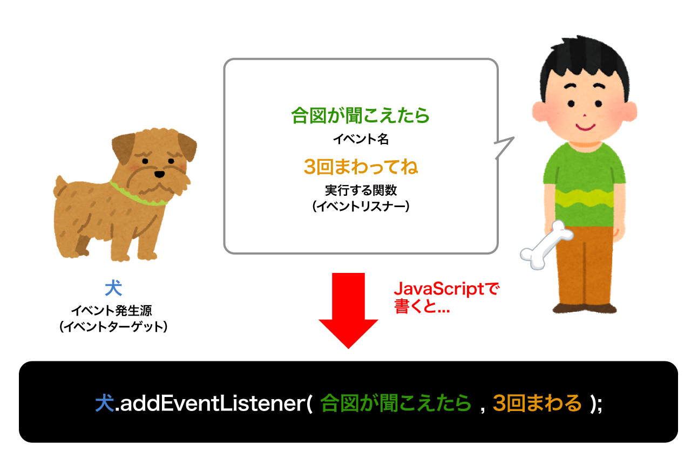

# イベントとは

ボタンをクリックした時、マウスポインターが乗った時、スクロールして一番下まで行った時、等々...  
ページ上の**ユーザーアクションや状態の変化を検知する仕組み。**

簡単に言うと _○○○ に、 △△△ が起こったら、 ××× して_ とお願いする仕組み。

上記の*〜して*と言う命令を `addEventListener()` というメソッドを使って行う。

## 書き方

```js
イベントの発生源.addEventListener("イベント名", 発生時に実行する関数);
```



# イベントの種類と例

`イベント名` には `click`,`load`,`scroll`などなど所定のイベントを指定できる。  
イベントターゲットはイベントの種類によって様々なので調べて使うこと。

参考: [JavaScript イベントハンドラ](https://web-designer.cman.jp/javascript_ref/event_list/)  
＊上記サイトのイベント名の`on`は無しで OK。

## click イベント

ある要素をクリックした時(スマホの場合はタッチして離した時)に発生するイベント。  
DOM 要素から発生する。

```js
// classが `alert-button` の要素を取得する。
const alertButton = document.querySelector(".alert-button");

// イベント発生時に呼び出される関数(イベントリスナー)を定義
function showGreeting() {
  alert("こんにちは");
}

// alertButtonが、clickされたら、showGreetingを実行して！
alertButton.addEventListener("click", showGreeting); // 関数名には `()`をつけない
```

<iframe height="300" style="width: 100%;" scrolling="no" title="ClickEvent" src="https://codepen.io/RsakaiForEducation/embed/YzzXNdG?height=265&theme-id=0&default-tab=result" frameborder="no" allowtransparency="true" allowfullscreen="true">
  See the Pen <a href='https://codepen.io/RsakaiForEducation/pen/YzzXNdG'>ClickEvent</a> by R Sakai
  (<a href='https://codepen.io/RsakaiForEducation'>@RsakaiForEducation</a>) on <a href='https://codepen.io'>CodePen</a>.
</iframe>

＊ 以下の様に関数定義を省略することも可能。

```js
const alertButton = document.querySelector(".alert-button");

alertButton.addEventListener("click", function () {
  alert("こんにちは");
});
```

## scroll イベント

ページや要素がスクロールした時に発生するイベント。  
主に `window`から発生する。

```js
// イベント発生時に呼び出される関数を定義
function getScrollPos() {
  console.log(window.scrollY);
}

// windowがscrollしたらgetScrollPosして！
window.addEventListener("scroll", getScrollPos);
```

## DOMContentLoaded イベント

DOM ツリーの準備ができたら発生するイベント。
`document` から発生する。

```js
function main() {
  console.log("DOMの準備完了");
}
document.addEventListener("DOMContentLoaded", main);
```

画像など、ページが全て読み込まれてから発火させたい場合は window から発生する`load`イベントを使う。

```js
function main() {
  console.log("全て読み込み完了");
}
window.addEventListener("load", main);
```

# イベントオブジェクト

イベントリスナーの引数には `イベントオブジェクト` という値が代入される。
発生した要素や、発生した位置や時間など、そのイベントに関する情報が色々と入っている。
＊イベントオブジェクトの中身はイベントの種類や発生した要素(イベントターゲット)によって変わる。

```js
const button = document.querySelector(".button");

// 第一引数にイベントオブジェクトが入る。
function showEventObj(event) {
  console.log(event);
}
alertButton.addEventListener("click", showEventObj);
```

## event.target

イベントが発生した要素が入る。  
複数の要素にイベント登録した時など、どの要素から発生したかを判定する時に使用する。

### `event.target`を使用した例

```js
// querySelectorAllで全ての`.click-button`要素を取得
const allButtons = document.querySelectorAll(".click-button");

// クリックされた要素のbackgroundColorを赤に変更
function changeColor(event) {
  const eventTarget = event.target; // クリックされた要素を取得
  eventTarget.style.backgroundColor = "#ff0000"; // 背景を赤に
  console.log(eventTarget);
}

// forで全ての要素にイベントを登録する。
for (let i = 0; i < allButtons.length; i++) {
  allButtons[i].addEventListener("click", changeColor);
}
```

<iframe height="500" style="width: 100%;" scrolling="no" title="QWWwZzv" src="https://codepen.io/RsakaiForEducation/embed/QWWwZzv?height=265&theme-id=0&default-tab=result" frameborder="no" allowtransparency="true" allowfullscreen="true">
  See the Pen <a href='https://codepen.io/RsakaiForEducation/pen/QWWwZzv'>QWWwZzv</a> by R Sakai
  (<a href='https://codepen.io/RsakaiForEducation'>@RsakaiForEducation</a>) on <a href='https://codepen.io'>CodePen</a>.
</iframe>

## event.preventDefault();

その要素のデフォルトアクションを停止する。  
＊ 例えば `<a>`タグをクリックした時にページを読み込まない様にする。

### `event.preventDefault()`を使用した例

```js
// ＊タグが <a> でhref属性が"#"から始まるものを取得
const anchorLink = document.querySelectorAll("a[href^='#']");

// aタグをクリックするとアニメーションスクロールする。
function smoothScroll(event) {
  event.preventDefault(); // ← これが無いとページ遷移してしまう。

  const targetID = event.target.getAttribute("href"); // href属性の値を取得
  const scrollToElement = document.querySelector(targetID);
  scrollToElement.scrollIntoView({
    behavior: "smooth",
  });
}

// forで全ての要素にイベントを登録する。
for (let i = 0; i < anchorLink.length; i++) {
  anchorLink[i].addEventListener("click", smoothScroll);
}
```

<iframe height="400" style="width: 100%;" scrolling="no" title="Scroll IntoView" src="https://codepen.io/RsakaiForEducation/embed/gOObQpw?height=265&theme-id=0&default-tab=result" frameborder="no" allowtransparency="true" allowfullscreen="true">
  See the Pen <a href='https://codepen.io/RsakaiForEducation/pen/gOObQpw'>Scroll IntoView</a> by R Sakai
  (<a href='https://codepen.io/RsakaiForEducation'>@RsakaiForEducation</a>) on <a href='https://codepen.io'>CodePen</a>.
</iframe>
