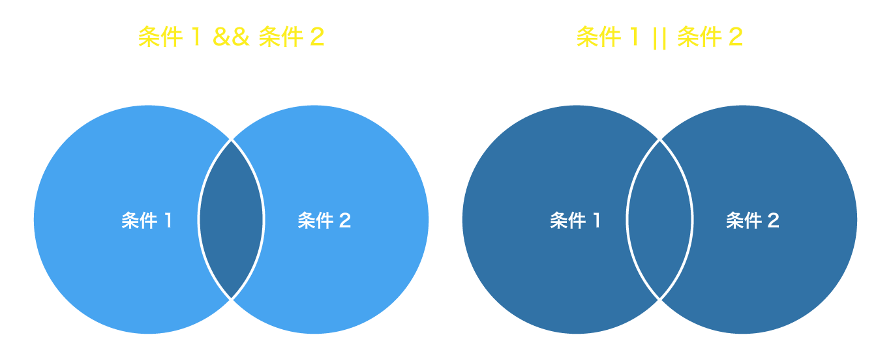

# 条件分岐 (if / else 文)

`if(条件式)` 処理を条件分岐させる。  
条件式が `true`の場合、中の処理が実行される。

```js
if (条件式) {
  // 条件に一致した時の処理
}
```

## 単体の値 （ truthy / falsy） での条件式

条件式の中は値によって `true` / `false`（Boolean） のどちらかに変換される。  
Boolean 以外の値も指定できる。

```js
const canDo = true;
if (canDo) {
  // ここは実行される
}

/* 条件の前に`!` をつけるとtrue/falseを反転できる。 */
if (!canDo) {
  // 実行されない
}

/* 数値の0は`false`として評価される。*/
if (0) {
  // 実行されない
}

/* null や undefined も `false` */
if (null) {
  // 実行されない
}

/* 空の文字列 も `false` */
if ("") {
  // 実行されない
}

/* `querySelector`で取得した要素 */
const element = document.querySelector(".element");
if (element) {
  // 要素が存在すれば実行される。
}
```

その他どんな値が true/false になるかは以下を参照

- [条件分岐 · JavaScript Primer](https://jsprimer.net/basic/condition/)
- [Falsy](https://developer.mozilla.org/ja/docs/Glossary/Falsy)
- [Truthy](https://developer.mozilla.org/ja/docs/Glossary/Falsy)

## [比較演算子](/basic/data-type-operator/#%E6%AF%94%E8%BC%83%E6%BC%94%E7%AE%97%E5%AD%90)を使った条件式

```js
/* 等価/不等価演算子で比較 `===` `!==` */
const myFavoridFood = "寿司";
if (myFavoridFood === "カレー") {
  // ここは実行されない
  console.log("あなたはカレー好きです。");
}

if (myFavoridFood !== "カレー") {
  // ここは実行される
  console.log("あなたはカレーが好きでは無いです。");
}

// 大なり小なり演算子で比較（数値限定）
const myAge = 25;
if (myAge > 19) {
  // ここは実行される
  console.log("あなたは成人です。");
}

if (myAge <= 19) {
  // ここは実行されない
  console.log("あなたは未成年です。");
}
```

## else 文 / else if 文

if に続けて、`else { }` を書くと、その上の条件に一致しなかった時の処理を書ける。

```js
if (条件式) {
  // 条件に一致した時の処理
} else {
  // その他の時
}
```

```js
const myAge = 45;
if (myAge < 20) {
  console.log("あなたは未成年です。");
} else {
  console.log("あなたは成人です。");
}
```

また、 `else if (条件) { }` を使うとその上の if 分の条件に一致しなかった中からさらに絞り込む処理を書ける。

```js
const myAge = 45;
if (myAge < 20) {
  console.log("あなたは未成年です。");
} else if (mayAge === 20) {
  console.log("あなたは二十歳です。");
} else {
  console.log("あなたは成人です。");
}
```

else if はいくつでも追加可能だが、多くなる場合は `switch` 文の方が簡潔に書ける。  
参考: [switch 文
](https://ja.javascript.info/switch)

## 論理演算子( `&&` `||`)



`&&` や `||` を使うと複数の条件を評価できる。

`A && B` は ”A かつ B”、  
`A || B` は ”A または B”という意味となる。

```js
const myNumber = 10;
if (myNumber % 2 === 0 && myNumber >= 10) {
  console.log(myNumber + "は二桁以上の偶数です。");
} else if (myNumber % 2 === 0 && myNumber < 10) {
  console.log(myNumber + "は一桁の偶数です。");
} else {
  console.log(myNumber + "は奇数です。");
}
```

参考: [論理演算子](https://jsstudy.hatenablog.com/entry/JS-Learning-marathon-Step14_1.2.11-logical-operators)

# ループ (for 文)

同じ処理を反復(ループ)して行う。  
また、配列の値を一つずつ取り出して処理をする時に使う。

```js
for (初期化式; 条件式; 増分式) {
  繰り返し実行する処理;
}
```

## 指定した回数の処理を実行

`for (let index = 最初の数; index < 回数; index++)`

```js
// 変数 indexを宣言し; indexが100より大きくなるまで; indexに1を足す
for (let index = 0; index < 100; index++) {
  console.log(index); // 0, 1, 2, ... 99
}
// indexが 100>=になると ループを抜ける。
```

> `++` は[インクリメント](https://jsprimer.net/basic/operator/#increment-operator)といい、直前の変数に `+1` する演算子。  
> `x++`は`x = x + 1` と同じ意味。  
> また、`-1`する場合は `--`

## 配列の値を一つずつ処理

```js
const myFriends = ["Tanaka", "Suzuki", "Yamada", "Saito", "Ikeda", "Mike"];

// myFriends.lengthは 6なので、indexは0〜5まで繰り返す。
for (let index = 0; index < myFriends.length; index++) {
  const friend = myFriends[index] + "さん";
  console.log(friend); // "Tanakaさん","Suzukiさん", ...,"Mikeさん"
}
```

`配列名.length` はその配列の要素数。  
 上記の例だと `myFriends.length` は `6` になる。

または、`for...of` を使うと以下の様にも書ける。

```js
const myFriends = ["Tanaka", "Suzuki", "Yamada", "Saito", "Ikeda", "Mike"];
for (const friend of myFriends) {
  console.log(friend);
}
```

## continue 文

`continue`を使うと、現在の処理を終了して、次の処理へジャンプする。
＊ `if()`と組み合わせて使う事が多い。

```js
const myFriends = ["Tanaka", "Suzuki", "Yamada", "Saito", "Ikeda", "Mike"];

for (let index = 0; index < myFriends.length; index++) {
  if (myFriends[index] === "Yamada") {
    continue; // これより下は実行されず、次の処理へスキップ。
  }
  console.log(myFriends[index]); // "Tanaka","Suzuki", "Saito", "Ikeda", "Mike"
}
```

## break 文

`break`を使うと途中でループを中断することができる。

```js
const myFriends = ["Tanaka", "Suzuki", "Yamada", "Saito", "Ikeda", "Mike"];

for (let index = 0; index < myFriends.length; index++) {
  if (myFriends[index] === "Yamada") {
    break; // [A]へ
  }
  console.log(myFriends[index]); // "Tanaka","Suzuki"  まで表示
}
// [A]
```

> その他 `while` や `array.forEach()` など様々なループ処理がある。  
> [ループと反復処理](https://jsprimer.net/basic/loop/)

# 要素リストの取得とループ

同じセレクタの要素を全て取得するには `querySelectorAll(セレクタ)` を使う。  
使い方は [querySelector()](/basic/variable-queryselector/#%E8%A6%81%E7%B4%A0%E3%81%AE%E5%8F%96%E5%BE%97)と同じだが、要素の _配列_ <sup>\*</sup>が返ってくる。  
<small>＊正確には NodeList という配列の様なオブジェクト。</small>

```js
const elements = document.querySelectorAll(".element");
// => [ 0: element, 1: element, 2: element, ...]
```

querySelectorAll() で一括取得した 1 つ 1 つの要素は for 文を使って取得できる。

```js
const elements = document.querySelectorAll(".element");

for (let index = 0; index < elements.length; index++) {
  const element = elements[index];
  console.log(element);
}
```

<iframe width="100%" height="400" src="//jsfiddle.net/sk_rt/m7b91aqf/73/embedded/result,js,html,css/dark/" allowfullscreen="allowfullscreen" allowpaymentrequest frameborder="0"></iframe>
