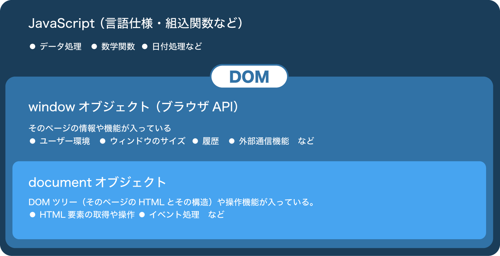

# JavaScript とは

ブラウザで動作するほぼ唯一のプログラミング言語。
HTML 要素の取得・変更、ユーザーアクションやセンサーの検知、サーバーとのデータ送受信、ローカルファイルの操作、などなどできる事は多岐に渡る。

また Node.js などブラウザ以外で動作する JavaScript もある。

## 本資料で扱う内容

- HTML 要素(DOM)の取得
- DOM の操作
- クリック・スクロールなどのイベント検知
- タイマーを使ったアニメーション
- etc.

# JS ファイルの作成・読み込み

JavaScript は拡張子 `.js` をつけて保存する。  
保存した js ファイルを HTML から読みこむと、内容のスクリプトが 1 度だけ実行される。

```directory
myApp
├── index.html
└── js
    └── main.js
```

```js
// main.js として保存
// アラート「Hello, JS」と表示される
alert("Hello, JS");
```

```html
<head>
  ...
  <!-- <head>内でmain.jsを読みこみ -->
  <script src="./js/main.js" defer></script>
  ...
</head>
```

## HTML に直接書く

外部ファイルとして保存せずに HTML に直接 script を書くこともできる。

```html
<head>
  ...
  <script>
    alert("Hello, JS");
  </script>
  ...
</head>
```

## ブラウザでの開発と Console API

Chrome で`表示 => 開発/管理`から開発者ツールを起動できる。(`option + ⌘ + i`)  
エラーなどが発生すると開発者ツールの `console` タブに表示される。

また、JavaScript の任意の場所に `console.log(値)` を入れると上記の `console`　に表示させることができる。

JS で Web 開発するのには必須なので _作業中は常に開発者ツール表示させる様にすること。_

```js
// `console` にログを出力
console.log("Hello, JS");
```

# DOM とは

_DOM（Document Object Model）_ は JavaScript で html を操作する仕組み。  
ブラウザの `window` / `document` オブジェクトを基準に操作できる。



```js
// window オブジェクトの中身をみてみよう
console.log(window);

// document オブジェクトの中身をみてみよう
console.log(document);
```

> #### 参考
>
> - [ブラウザ環境, 仕様](https://ja.javascript.info/browser-environment)
> - [DOM ツリー](https://ja.javascript.info/dom-nodes)
