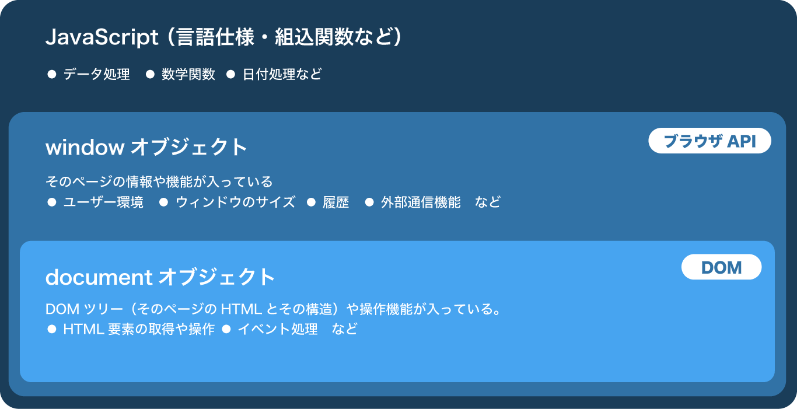

# JavaScript とは

ブラウザで動作するほぼ唯一のプログラミング言語。
HTML 要素の取得・変更、ユーザーアクションやセンサーの検知、サーバーとのデータ送受信、ローカルファイルの操作、などなどできる事は多岐に渡る。 [Web API 一覧](https://developer.mozilla.org/ja/docs/Web/API)

また Node.js などブラウザ以外で動作する JavaScript もある。

## 本資料で扱う内容

- HTML 要素(DOM)の取得
- DOM の操作
- クリック・スクロールなどのイベント検知
- タイマーを使ったアニメーション
- etc.

# JS ファイルの作成・読み込み

JavaScript は拡張子 `.js` をつけて保存する。  
保存した js ファイルを HTML から読みこむと、内容のスクリプトが 1 度だけ実行される。

```directory
myApp
├── index.html
└── js
    └── main.js
```

```js
// main.js として保存
// アラート「Hello, JS」と表示される
alert("Hello, JS");
```

```html
<head>
  ...
  <!-- <head>内でmain.jsを読みこみ -->
  <script src="./js/main.js" defer></script>
  ...
</head>
```

＊script タグに `defer 属性`をつけること。理由は[後述](/basic/variable-queryselector/#%E8%A6%81%E7%B4%A0%E3%82%92%E5%8F%96%E5%BE%97%E3%81%A7%E3%81%8D%E3%81%AA%E3%81%84)する

## HTML に直接書く

外部ファイルを読み込まずに インラインで script を書くこともできる。

```html
<head>
  ...
  <script>
    alert("Hello, JS");
  </script>
  ...
</head>
```

# 記法と Console API / コメント

## 基本記法

JavaScript 上から順番に処理される。
また行末には必ずセミコロンを入れること

```js
alert("1番");

alert("2番");

// 1番、2番、と順番にアラートが表示される。
```

## Console API

また、JavaScript の任意の場所に `console.log(値)` を入れると下記の開発者ツールの `console`　に表示させることができる。

```js
// `console` にログを出力
console.log("Hello, JS");
```

## コメント

`// コメント` または `/* コメント */`で任意の場所にコメントを書く事ができる。  
コメン t はプログラムとして実行されない。  
また、VS Code では`⌘ + /` でその表をコメントアウトできる。

```js
// 一行コメント

/* 
  複数行コメント
  説明などを書く
*/
```

## 開発者ツール

Chrome で`表示 => 開発/管理`から開発者ツールを起動できる。(`option + ⌘ + i`)  
エラーなどが発生すると開発者ツールの `console` タブに表示される。

JS で Web 開発するのには必須なので _作業中は常に開発者ツール表示させる様にすること。_

# DOM とは

_DOM（Document Object Model）_ は JavaScript で html を操作する仕組み。  
ブラウザの `window` / `document` [オブジェクト](/basic/data-type-operator/#%E3%82%AA%E3%83%96%E3%82%B8%E3%82%A7%E3%82%AF%E3%83%88%E5%9E%8Bobject)を基準に操作できる。



```js
// window オブジェクトの中身をみる
console.log(window);

// document オブジェクトの中身をみる
console.log(document);
```

<iframe width="100%" height="300" src="//jsfiddle.net/sk_rt/5ojbw4tq/embedded/result,js/dark/" allowfullscreen="allowfullscreen" allowpaymentrequest frameborder="0"></iframe>

> #### 参考
>
> - [オブジェクト](https://jsprimer.net/basic/object/)
> - [ブラウザ環境, 仕様](https://ja.javascript.info/browser-environment)
> - [DOM ツリー](https://ja.javascript.info/dom-nodes)
