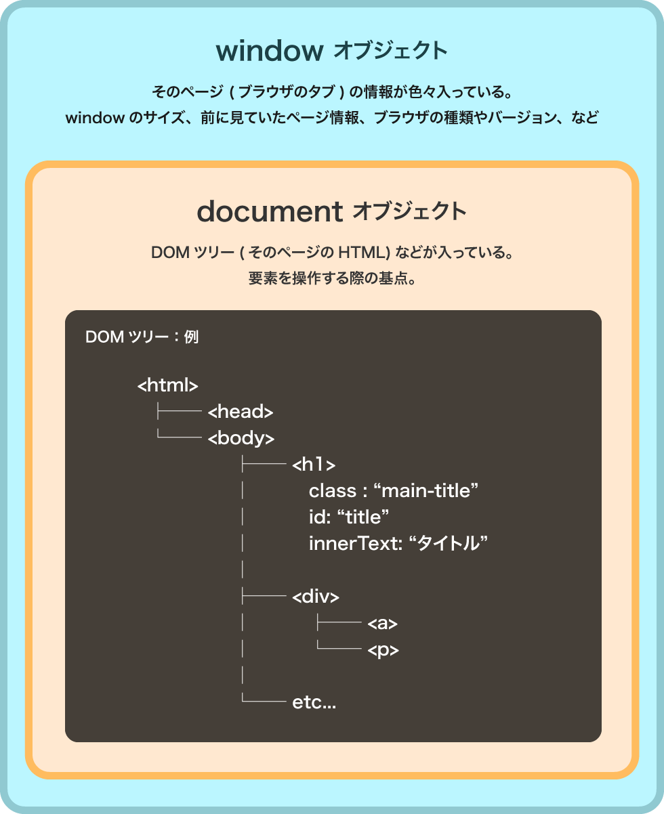

# DOM とは

_DOM（Document Object Model）_ JavaScript で html を操作する仕組み。  
ブラウザの `window` / `document` オブジェクトを基準に操作できる。



```js
// window オブジェクトの中身をみてみよう
console.log(window);

// document オブジェクトの中身をみてみよう
console.log(document);
```

# Window オブジェクト

js で取得できる、そのページの全ての情報が入っている。  
＊ window は省略できる。例えば `window.alert()` は window を省略して`alert()`とも書ける。

## 代表的なプロパティ / メソッド

参考: [window](https://developer.mozilla.org/ja/docs/Web/API/Window)

### window.innerWidth / innerHeight

ブラウザーウィンドウの横幅・高さを取得できる。＊読み取りのみ

```js
const windowWidth = window.innerWidth;
const windowHeight = window.innerHeight;
```

### window.scrollY

スクロールの位置を取得

```js
const scrollY = window.scrollY;
```

# Document オブジェクト

そのページの`DOM ツリー`(全 html 要素) が入っている。  
＊`document`は`window.document`の省略。

```js
// <body>タグ
const thisBody = document.body;

// <html>タグ
const thisHtml = document.documentElement;

// 最初の <h1>タグ
const thisTitle = document.querySelector("h1");
```
